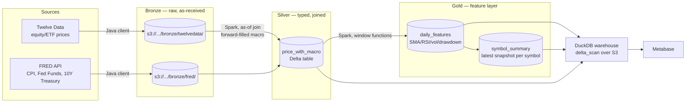

# Market Data Platform

A local-first data lake that joins daily equity/ETF prices with US
macroeconomic indicators (interest rates, inflation, treasury yields) to
support factor-style analysis — correlation, CAPM beta/alpha, regime
comparisons — end to end, from raw API ingestion to a BI dashboard.

Built as a companion project to [`macroeconomics-ai`](#), reusing the same
Bronze → Silver → Gold pattern established in `agri-data-lake`, applied here
to financial markets instead of agricultural/climate data.

## Why this exists

Most portfolio projects that touch financial data stop at "pull some prices,
plot a line chart." This one goes a layer deeper: it treats price data and
macro data as two series that need to be reconciled on different calendars
(macro releases are monthly/irregular, trading days are daily), computes the
technical indicators an actual quant/analyst workflow would want (SMA, RSI,
realized volatility, drawdown), and exposes it through SQL a BI tool can
query — not just a notebook that ends there.

## Architecture



All storage runs against [Floci](https://floci.io) (a LocalStack-style AWS
emulator), so the whole pipeline runs on a laptop with `docker compose up` —
no AWS account or cloud spend required to develop or demo it.

## Tech stack

| Layer            | Tooling                                              |
|-------------------|-------------------------------------------------------|
| Extraction         | Java 17, `java.net.http`, AWS SDK v2 (S3 client)      |
| Storage            | Delta Lake on S3 (emulated via Floci)                 |
| Transformation     | Apache Spark 4.0 (Scala 2.13)                         |
| Query layer        | DuckDB (`delta` + `httpfs` extensions)                |
| BI / dashboards    | Metabase (custom image with a DuckDB JDBC driver)     |
| Orchestration      | Docker Compose                                        |
| Build              | Maven                                                 |

## Data sources

- **[Twelve Data](https://twelvedata.com)** — daily OHLCV for equities and
  ETFs. Free tier: 800 requests/day, 8/minute, up to 5,000 data points per
  symbol — enough for multi-year daily history.
- **[FRED](https://fred.stlouisfed.org)** — `CPIAUCSL` (CPI), `FEDFUNDS`
  (federal funds rate), `DGS10` (10-year treasury yield). Free, no
  meaningful rate limit for this scale of use.

### A note on the price data source (a small case study in vendor risk)

This project didn't start on Twelve Data. It went through two prior sources,
each abandoned for a documented, reproducible reason — which ended up being
a useful lesson in not hard-coupling a pipeline to a single free-tier API:

1. **Alpha Vantage** — the initial choice. Its free tier silently downgraded:
   `outputsize=full` on `TIME_SERIES_DAILY` became a premium-only parameter,
   so full-history backfills started failing with a `200 OK` response
   containing an `"Information"` field instead of actual data.
2. **Stooq** — a keyless CSV endpoint, adopted as a quick, credential-free
   replacement. It later started gating automated requests behind a
   captcha-issued API key, which defeats the "keyless, unattended
   extraction" property that made it attractive in the first place.
3. **Twelve Data** — the current source. Official API, documented free-tier
   limits, and enough history per request to make the technical indicators
   (`sma_200` needs ~200 trading days of warm-up) actually meaningful.

The symbol and FRED series lists are not hard-coded — they're read from the
`TWELVE_SYMBOLS` and `FRED_SERIES` environment variables (comma-separated),
so growing the universe of tracked assets doesn't require a rebuild.

## What's in the Gold layer

`daily_features` (one row per `symbol` + `date`):

- Returns: `return_1d`, `return_5d`, `return_21d`, `return_63d`
- Trend: `sma_20`, `sma_50`, `sma_200` and each price's distance from them
- Volatility: `vol_21d`, `vol_63d`, annualized (`vol_ann_21d`)
- Momentum: `rsi_14`
- Risk: `drawdown_252d` (distance from the trailing 252-day high)
- Macro, forward-filled onto every trading day: `cpi`, `fedFundsRate`,
  `treasury10y`, plus their period-over-period changes
- Volume: `volume_rel_20d` (volume relative to its 20-day average)

`symbol_summary` is a MERGE-upserted snapshot of the latest row per symbol —
built for "what does this asset look like right now" queries without
scanning full history.

Both tables are upserted (Delta `MERGE`, not overwrite), so re-running the
Gold job after adding a new symbol or backfilling more history doesn't
duplicate or blow away existing rows.

## Running it locally

```bash
# 1. Copy the example env file and fill in your own API keys
cp .env.example .env
# TWELVE_SYMBOLS=AAPL,MSFT,GOOGL,NVDA,AMD,AVGO,ORCL,CRM,QQQ,XLK,VGT,SOXX,SPY
# FRED_SERIES=CPIAUCSL,FEDFUNDS,DGS10
# TWELVEDATA_API_KEY=...
# FRED_API_KEY=...

# 2. Bring up storage, warehouse and BI
docker compose up -d

# 3. Run extraction (Bronze) — from your IDE or via Maven exec
mvn exec:java -Dexec.mainClass=com.tech.BronzeExtractionRunner

# 4. Run the Spark jobs (Silver, then Gold), in order
mvn exec:java -Dexec.mainClass=com.tech.transform.SparkMarketTransformJob
mvn exec:java -Dexec.mainClass=com.tech.transform.SparkGoldJob
```

> **Running Spark on JDK 17+:** Spark's driver/executor JVMs need
> `--add-opens` flags to access internals the JDK module system blocks by
> default (`sun.util.calendar.ZoneInfo`, among others). See
> [`docs/jdk17-spark.md`](#) — or, in short, add
> `--add-opens java.base/java.lang=ALL-UNNAMED` (and the handful of
> siblings listed there) to your run configuration's VM options.

After the Gold job succeeds, refresh the DuckDB warehouse (Metabase holds a
lock on the `.duckdb` file while it's running, so it needs to step aside
first):

```bash
docker compose stop metabase
docker compose run --rm duckdb-init
docker compose start metabase
```

## Example analysis: CAPM alpha/beta against SPY

With SPY included in `TWELVE_SYMBOLS` as a broad-market proxy, the warehouse
supports genuine CAPM-style analysis directly in SQL — no notebook required:

```sql
WITH spy AS (
    SELECT date, return_1d AS spy_return
    FROM gold_daily_features
    WHERE symbol = 'SPY'
),
ativos AS (
    SELECT symbol, date, return_1d
    FROM gold_daily_features
    WHERE symbol != 'SPY'
)
SELECT
    a.symbol,
    COVAR_SAMP(a.return_1d, s.spy_return) / VAR_SAMP(s.spy_return) AS beta,
    CORR(a.return_1d, s.spy_return) AS correlation_to_spy,
    AVG(a.return_1d) - AVG(s.spy_return) AS naive_alpha
FROM ativos a
JOIN spy s ON a.date = s.date
GROUP BY a.symbol
ORDER BY beta DESC;
```

More examples — an asset-to-asset correlation matrix, interest-rate regime
comparisons, and volatility/RSI-based signal screens — live in
[`docs/example-queries.sql`](#).

## Known limitations

- **History depth**: the pipeline has only been collecting data for a short
  window so far. Correlation and beta figures are directionally interesting
  but not statistically reliable yet — treat single-digit-month sample
  sizes with appropriate skepticism.
- **No point-in-time macro data**: FRED values are forward-filled by
  release date, not by the date they were actually known to the market
  (macro releases are often revised after the fact). This is a common
  simplification, not a bug, but it means the macro join isn't
  survivorship/look-ahead-bias-free.
- **Local-only storage emulation**: Floci stands in for S3 for development
  convenience; the Spark jobs' S3A configuration would need real AWS
  credentials (not `SimpleAWSCredentialsProvider`) to run against actual
  AWS.

## License

MIT — see [`LICENSE`](./LICENSE).

## Author

Douglas Holanda — backend engineer, Ceará, Brazil. More writing at
[douglas-holanda.hashnode.dev](https://douglas-holanda.hashnode.dev).